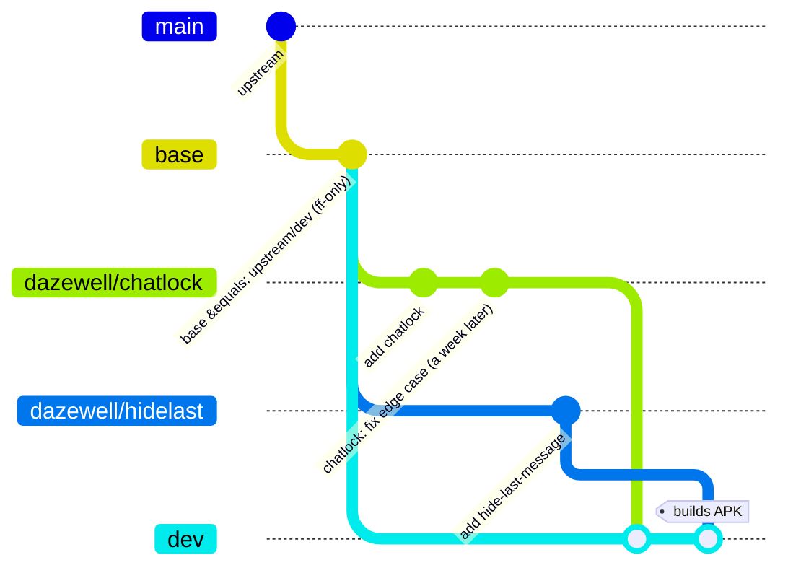

# NagramX branch & integration flow

This is the **plumbing** layer for dazewell's fork. The `nagramx-workflow`
skill still owns *what a change looks like* (design review round 1, minimal
hooks, compile gate, code review round 2, README + humanizer, commit style,
no AI in the log). This skill owns *where commits live and how they move* —
the branch topology, upstream sync, and the phone-triggered automation.

Read `nagramx-workflow` for the change itself; read this for the git
choreography around it.

## Why this model exists (the problem it solves)

The old model kept **one branch (`dev`) doing two conflicting jobs**: it was
both the pristine, upstream-proposable linear history *and* the branch that
built the daily APK. Keeping that single branch clean forced:
- constant `git push --force-with-lease` (rebasing to stay linear),
- squash-to-one-commit-per-feature, which made it painful to attach a
  bugfix found a week later back to its feature,
- a fragile upstream rebase where one conflict left `dev` mid-rebase.

This model **splits those two jobs apart** so nothing in the daily loop
force-pushes, features stay whole, and upstream rebases become cheap.

## The topology

Remotes (as configured in this clone):
- `origin` → `dazewell/NagramX` (personal fork)
- `source` → `risin42/NagramX` (base fork)

The base-fork remote is named **`source`** locally — every command below uses
that. (The `sync-upstream.yml` CI job runs on a fresh checkout and adds its
own `source` remote, so the name matches there too.)

Branches:
- **`base`** — a mirror of `source/dev`. **Fast-forward only**; it only ever
  moves forward, so it is *never* force-pushed. This is the clean upstream
  reference everything is cut from.
- **`dazewell/<slug>`** — one **topic branch per feature**, cut from `base`.
  **Append-only in daily work**: found a bug or improvement later? Add a
  commit here, don't hunt down an old squashed commit. A feature's entire
  history is the range `base..dazewell/<slug>`. Because you only append, a
  topic branch is **never force-pushed** during normal work.
- **`dev`** — the **integration / build branch**. It is `base` with every
  active topic **merged** into it. Merges never force-push. `dev` is
  **disposable**: nothing is ever based on it and it is never proposed
  upstream, so its merge-bubble history is fine. `staging.yml` still builds
  the dual APK from `dev` on push.



The one rule that makes it all work: **topic branches are append-only and
are almost never rebased.** `dev` merges them. A topic is rebased in only
two situations — the upstream-proposal ceremony (on a *throwaway copy*), and
the rare case where the feature itself must adopt newer upstream API to keep
working (see "When something on `dev` breaks my feature" below). Everything
else is handled by `dev` merging, so the living topic is essentially never
rewritten.

## Which requirement each piece answers

| Wish | How this model delivers it |
| --- | --- |
| Feature commits discoverable for upstream | all of a feature = `git log base..dazewell/<slug>` |
| Fix found a week later stays tied to the feature | commit it on `dazewell/<slug>`, re-merge into `dev` |
| No force pushes in the daily loop | `base` ff-only, topics append-only, `dev` merge-forward |
| Easy rebase onto base fork | `base` fast-forwards; topics don't rebase for builds; conflicts (rare, thanks to minimal hooks) surface once, in `dev` |
| Propose a clean single commit upstream | rebase a throwaway `-pr` copy `--onto source/dev` and squash *at that moment* |
| Phone-triggered sync → build → Telegram | `sync-upstream.yml` (`workflow_dispatch`), conflict-guarded |

## Do I keep feature branches updated? (short answer: no)

This is the part that trips people up, so it gets its own section. **You do
not routinely update, rebase, or "catch up" a `dazewell/<slug>` topic
branch.** A topic branch is meant to stay parked at whatever upstream point
it was cut from, carrying only its own feature commits. Chasing upstream on
every topic is precisely the force-push treadmill this model removes.

The trick is that **upstream and your features meet in `dev`, not on the
topics.** When the base fork moves, you move `base` and re-merge into `dev`.
The topics don't budge. `dev` does the reconciling.

Walk a concrete timeline for `dazewell/chatlock` (upstream commits U1…U5):

- **Cut it.** `base` is at U1. You branch `dazewell/chatlock` off `base`,
  add one commit, merge into `dev`, build. The topic sits on U1.
- **Upstream releases U2.** Sync: `base` fast-forwards to U2, you merge
  `base` into `dev`, re-merge `dazewell/chatlock` (no new commits → nothing
  happens), build. **The topic is still on U1 — you did not touch it.**
- **A week later you find a chatlock bug.** `git switch dazewell/chatlock`
  (still on U1), commit `dazewell: chatlock — fix X`, merge into `dev`.
  **Still no rebase.** The fix is now part of the feature forever.
- **Upstream reaches U5 and you decide to propose chatlock.** *Now* — and
  only now — you copy the topic to `dazewell/chatlock-pr`, rebase the copy
  onto `source/dev`, squash, and PR it. **The living `dazewell/chatlock`
  is still on U1**, untouched, append-only.

So the decision rule is:

- **Adding more work to the feature?** Just commit on the topic as-is. Don't
  rebase it first.
- **A merge into `dev` conflicts after an upstream bump?** Resolve it **in
  `dev`** (that merge commit), not by rebasing the topic. The topic stays
  pinned and proposable.
- **Proposing the feature upstream?** *Then* replay it onto current upstream
  — on a throwaway `-pr` copy, never the original.

The only real cost of never updating a topic: if it sat for months while
upstream moved a lot, the *proposal-time* rebase might hit conflicts. That's
fine — you resolve them once, at proposal time, on the copy. You don't
pre-pay that cost by rebasing continuously. Because NagramX features are
minimal-footprint hooks (see `nagramx-workflow`), that proposal-time rebase
is usually trivial anyway.

## When something on `dev` breaks my feature

The topic never getting the newer code is **not** a wall. A topic doesn't
need to *keep* the newer code to be fixed — it only needs it to *develop and
test* the fix. So you borrow the new world temporarily (in `dev`, which has
everything, or in a throwaway rebased copy), work out the exact edit, then
carry only your feature's edit back onto the topic as one more append commit.

First decide **whose bug it is**:

| Situation | Whose fault | Where the fix lives |
| --- | --- | --- |
| My feature is now wrong against the new code (upstream renamed a method my hook calls, changed a signature) | mine | on the **topic** (usually) |
| Two independently-correct things clash only when combined (my hook and another feature's hook edit the same method) | neither | in the **`dev` merge**, touch no topic |

Then pick the resolution:

1. **The fix works on old *and* new upstream** (a null guard, a different
   menu id, a defensive check — most hook fixes). Just commit it on the
   topic; it compiles at the old base and behaves against the new one. `dev`
   proves it. Done.

2. **The fix needs new upstream API that didn't exist at the topic's base**
   (e.g. upstream renamed `getCurrentChat()` → `getChatInfo()` and only the
   new name exists now). The topic can't both stay pinned *and* call the new
   method, so choose:
   - **Move that one topic forward** onto the new `base` — the *sanctioned,
     rare* rebase (`--force-with-lease` on that single topic). Legitimate
     because the feature itself must change to survive upstream; it's not the
     weekly treadmill.
     ```powershell
     git switch dazewell/<slug>
     git rebase --onto base <old-base> dazewell/<slug>   # move up to current upstream
     # adapt the hook to the new API, commit, push --force-with-lease (the one allowed rewrite)
     ```
   - **Or keep the topic pinned and let `dev`'s merge carry the adaptation.**
     The topic stays on its old base; the `dev` merge resolution uses the new
     API (because `dev` is on new upstream). You re-derive the clean form at
     proposal time anyway (the `-pr` rebase onto `source/dev` naturally writes
     the new-API version), so nothing is lost.

3. **Pure clash between your feature and another feature** (both fine alone).
   Resolve it right in the `dev` merge and push `dev`. Touch neither topic —
   that resolution living only in disposable `dev` is the point, and it keeps
   both topics independently proposable.
   ```powershell
   git switch dev
   git merge --no-edit dazewell/<other>   # they collide here
   # resolve the interaction (ordering, id, guard), commit the merge, push dev
   ```

**Developing a topic fix against code the topic can't see:** reproduce and
work out the fix where the new code exists, then carry only the fix back:
```powershell
git switch -c <slug>-test dazewell/<slug>
git rebase --onto base <old-base> <slug>-test   # temporarily on new upstream
# ...fix, compile, verify here...
git switch dazewell/<slug>
git cherry-pick <fix-sha>        # carry ONLY the fix onto the real topic
git branch -D <slug>-test        # throwaway, gone
git switch dev; git merge --no-edit dazewell/<slug>; git push origin dev
```

## Case-by-case procedures (PowerShell)

### One-time setup / migration
```powershell
git remote add source https://github.com/risin42/NagramX.git   # if missing
git fetch source dev
git switch -c base source/dev          # create the mirror
git push -u origin base
# dev becomes the integration branch; rebuild it fresh from base + topics:
git switch dev
git merge --no-edit base
```
Existing `dazewell/<slug>` branches keep working as topic branches — just
stop rebasing them; append instead.

### Start a new feature
```powershell
git fetch source dev
git switch base; git merge --ff-only source/dev        # keep base current
git switch -c dazewell/<slug> base
# ...do the nagramx-workflow steps: design review, hooks, compile, code review, README...
git push -u origin dazewell/<slug>
```

### Land a feature into the build (integration)
```powershell
git switch dev
git merge --no-edit dazewell/<slug>
git push origin dev            # normal push -> staging.yml builds + uploads
```
Add `dazewell/<slug>` to `.github/integration-branches.txt` so the sync
automation knows to re-merge it. If you'd rather land through a review PR on
`origin`, that's fine — just **merge it with a merge commit, never a
squash-merge**, so the feature's commits stay whole and `dev` never needs a
force-push. Squash is reserved for the upstream `-pr` (below). PRs to the
base fork are a separate thing from landing into `dev`.

### Add a fix/improvement to an existing feature (the "week later" case)
```powershell
git switch dazewell/<slug>
# ...implement the fix (compile gate, review, README if user-visible)...
git commit -m "dazewell: <slug> — <what the fix does>"
git push origin dazewell/<slug>          # append, never force
git switch dev; git merge --no-edit dazewell/<slug>; git push origin dev
```
The fix now lives with the feature forever; the whole thing is still
`base..dazewell/<slug>`. You don't need to rebase the topic onto newer
upstream first — see "When something on `dev` breaks my feature" if the fix
turns out to need new upstream API.

### Sync onto a new upstream (manual / from PC)
```powershell
git fetch source dev
git switch base; git merge --ff-only source/dev; git push origin base
git switch dev; git merge --no-edit base                 # bring upstream into the build
# re-merge active topics (picks up nothing if already merged):
foreach ($b in Get-Content .github/integration-branches.txt) { git merge --no-edit "origin/$b" }
git push origin dev                                       # normal push -> build
```
If a merge conflicts, it's because a topic's hook collides with new upstream
code. Resolve it **in `dev`** (a one-time merge resolution) — do **not**
rebase the topic. Topics stay pristine. Only if the topic itself needs to
change for upstream do you touch it (see the breakage section above).

### Propose a feature to the base fork (the only routine place rebasing/force happens)
```powershell
git fetch source dev
git switch -c dazewell/<slug>-pr dazewell/<slug>          # throwaway copy
git rebase --onto source/dev base dazewell/<slug>-pr      # replay feature onto pristine upstream
git rebase -i source/dev                                  # squash to one clean dazewell: commit
git push origin dazewell/<slug>-pr
gh pr create --repo risin42/NagramX --base dev --head dazewell:dazewell/<slug>-pr
```
The living `dazewell/<slug>` is untouched. Delete the `-pr` branch after the
PR merges (deleting a branch is not a force-push). This is the routine
ceremony that rewrites history, and it does it on a copy — the only other
rewrite is the rare "feature must adopt new upstream API" case above.

### Retire a feature from the build
Remove it from `.github/integration-branches.txt`, then rebuild `dev`:
```powershell
git switch base; git branch -f dev-new base
git switch dev-new
foreach ($b in Get-Content .github/integration-branches.txt) { git merge --no-edit "origin/$b" }
# review dev-new builds fine, then adopt it:
git branch -M dev-new dev; git push origin dev
```
Rebuilding `dev` this way is a deliberate, occasional housekeeping step, not
part of the daily loop — and it's the only time `dev` is recreated.

## Automation

### Phone-triggered sync → build → Telegram (`sync-upstream.yml`)
The live `.github/workflows/sync-upstream.yml` replaces the old
rebase-and-force-push logic with a **merge-forward, conflict-guarded** flow.
Triggerable from the **GitHub mobile app** ("Run workflow") or a Telegram bot
that hits the `workflow_dispatch` REST API. Behaviour:

1. Fast-forward `base` from `source/dev` (creates `base` on first run).
2. `git merge --no-edit base` into `dev`, then merge each branch listed in
   `.github/integration-branches.txt`.
3. **Conflict guard:** if any merge is not clean → `git merge --abort`,
   reset `dev` to its pre-sync SHA, **push nothing**, and send a Telegram
   message like `⚠️ sync blocked: <branch> conflicts with the base fork —
   needs the PC`. Exit non-zero.
4. If everything merged clean → `git push origin dev` (normal push). That
   push triggers `staging.yml`, which builds the dual APK and uploads to
   Telegram through the existing `upload.py` — so the "new version shows up
   in Telegram" behaviour is reused, not rebuilt.

Core of the job (the conflict-guarded merge; full file has checkout /
identity / remote / notify steps). It reuses the `HELPER_BOT_TOKEN` /
`HELPER_BOT_TARGET` secrets that `staging.yml` already uses for Telegram:
```yaml
- name: Merge-forward dev (conflict-guarded)
  id: merge
  run: |
    git switch dev
    PRE=$(git rev-parse HEAD); echo "pre=$PRE" >> "$GITHUB_OUTPUT"
    merge() { git merge --no-edit "$1" || { git merge --abort || true; git reset --hard "$PRE"; echo "conflict=$1" >> "$GITHUB_OUTPUT"; exit 1; }; }
    merge base
    while IFS= read -r b; do b="$(echo "$b" | sed 's/#.*//' | xargs)"; [ -n "$b" ] && { git fetch origin "$b"; merge "origin/$b"; }; done < .github/integration-branches.txt
- name: Push dev (clean only)
  run: git push origin dev            # triggers staging.yml -> APK -> Telegram
```

### Telegram → GitHub trigger (optional, for a true "type a command" phone flow)
A tiny bot command (or a shortcut) that POSTs to
`POST /repos/dazewell/NagramX/actions/workflows/sync-upstream.yml/dispatches`
with a fine-grained PAT (scope: Actions: read/write on this repo only). The
GitHub mobile app's built-in "Run workflow" button already covers this with
no extra infra, so build the bot only if the one-tap command is worth it.

## The "Integrator" reviewer role (optional agent persona)

When a phone-triggered sync reports a conflict, or before a tricky upstream
proposal, spin up a subagent role-played as an **integration maintainer**
(think a Linux `-next` tree maintainer): give it the conflicting hunk and
the topic's `base..dazewell/<slug>` range and ask *where* the resolution
belongs — resolve-in-`dev` (a transient upstream collision) vs.
fix-the-topic (the feature genuinely needs to adapt to upstream). This keeps
topics pristine and stops one-off merge fixes from silently drifting into a
feature's proposable history. It's the same adversarial-reviewer habit as
`nagramx-workflow`'s two review rounds, applied to git topology.

## Keeping this current

Same rule as every doc here: when the flow changes, edit this file in the
same session, and keep `CLAUDE.md`, the `nagramx-workflow` skill, and the
memory maps in sync. The hard line from `nagramx-workflow` still governs
everything below the surface: **no AI mentions in git logs (commit
messages, PR titles/bodies, trailers) or in the app's source.** This
process doc may describe the flow openly; the history and code may not.
