# Dazegram features

Extra bits I've added on top of [NagramX](https://github.com/risin42/NagramX). Most are on out of the box. Where something has a setting, I've said so.

## Chats and privacy

### Per-chat time zones <!-- #timezones -->

Set a time zone for any personal chat or group through the profile edit view. The chat header and contacts list show the peer's current local time as a clock pill. Tap the pill to get a side-by-side time converter in a bottom sheet. Slide the strip to line up a moment in both zones, or hit "Now". You can drop the lined-up time into the message box. The template renders from a collapsible *Message format* section, where you can tap tokens like `{peer_time}`, `{offset}`, `{my_range}`, or `{duration}` into the template, and you can pick the language the message renders in. Next to "Now", there's a *Range* pill for when you need a window instead of a single moment. When you schedule a message to a chat with a zone set, the schedule sheet gains a *My time* / *Peer's time* tab above the picker wheels to schedule in their time.

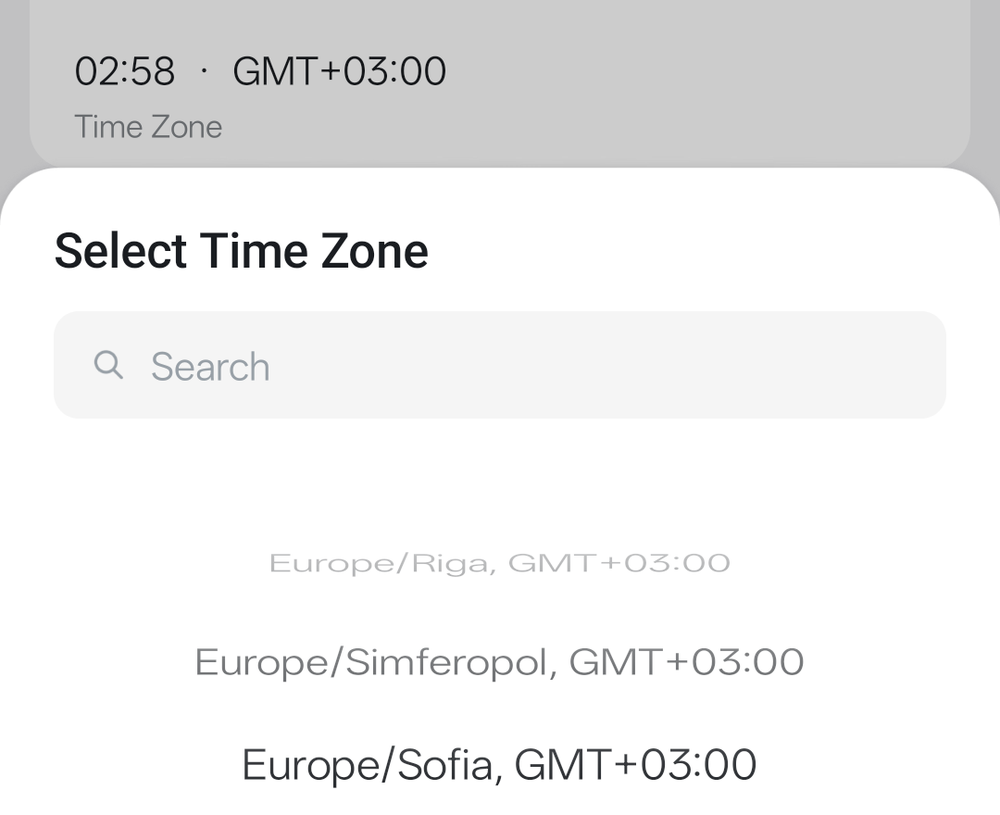
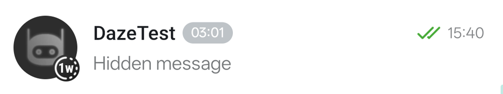

### Customized privacy <!-- #customized-privacy --> <!-- #hide-last-message --> <!-- #require-password --> <!-- #disguise-alerting -->

Each chat has one `Chat privacy` item in its ⋯ menu, opening one sheet with `Hide last message` (custom placeholder text) and `Require password`. Turning `Require password` on still auto-enables hiding only when hiding was off; turning it off does not turn hiding off.

The same sheet has `Disguise notifications` with cover persona selection and `Preview notification`. The old per-chat `Alert normally` row is gone: covered notifications now follow Telegram's own silent-vs-alert signal per event, and can alert only when that covered dialog has newly represented members since its last posted cover. Mute/per-chat sound/channel/watch tuning stays in Telegram/Android settings. The sheet uses compact section cards (privacy card, notifications card, collapsed `How covers work` footer disclosure), and its bulletins use Telegram's stock bottom placement.

### Privacy profiles <!-- #privacy-profiles -->

Save a set of auto-lock timeouts under Nagram Settings > Passcode and switch between them. Activate a profile for now, for a stretch of time, or until a specific moment. Long-press the Settings tab for the "Auto-lock profile" list to quickly switch. Each profile gets its own icon and colour. Changing the auto-lock timeout through the regular picker, restoring a backup, or clearing your passcode will drop whatever profile was active and adopt the new baseline value.

### Passcode setup safety <!-- #passcode-setup-safety -->

Setting a Panic Code that matches an unlock code is a security risk. Setup now ensures your Panic Code is unique; it cannot match your app passcode or any account's passcode. The setup screens also state clearly which code you are setting (App, Panic, or Account) to prevent confusion. Old Panic Codes set before this safety check existed might clash; the settings screen will prompt you to re-set your Panic Code if you are unsure it is unique.

### Reply threads in private chats <!-- #personal-replies -->

Private chats now show a reply glyph and count next to a message's timestamp, bringing group-style reply threads to 1-to-1 chats. Tap the reply count to swap the history for the message and its replies without leaving the chat.

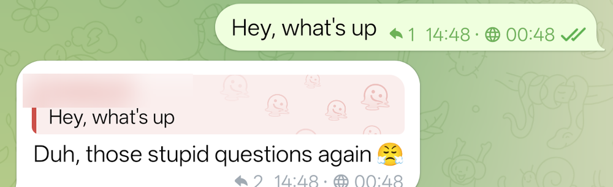

### Message bookmarks <!-- #bookmarks-300 -->

Bookmarks come from NagramX; this fork raises the per-chat cap from 30 to 300. Saving from the message menu, per-account storage, and inclusion in settings backup and restore all work as they did.

### Ayu Mode shortcut <!-- #ayu-mode -->

A launcher shortcut (long-press the app icon, or pin it to your home screen) that opens the app with Ghost Mode already on. Tapping it flips every Ghost toggle you haven't locked and pushes you offline, then opens as normal.

### Hold messages while Ghost Mode is on <!-- #ghost-hold -->

Turn on **Hold Messages** under Settings → Ghost Mode (off by default) and, while Ghost Mode is active, most plain text messages you send or schedule stay on your device instead of going to the server, so they can't reveal that you're online. Held messages land in that chat's Scheduled list marked "Held — not sent", and a bulletin reminds you each time. When you turn Ghost Mode off you're asked to confirm, then everything held sends, spaced out over a few seconds; a message you scheduled for a future time is handed to the server as a normal scheduled message instead. Attachments and a few special sends — paid chats, disappearing messages — never hold and go out right away; and if a held message is in a chat that now charges to send, it stays held rather than paying on your behalf, so turn-off reports it as not sent and you send it by hand at the price shown. Held messages live only in the database — uninstalling the app discards them.

### Ghost icon stays put under stories <!-- #ghost-icon -->

With Ghost Mode on, the ghost indicator next to the chat list title stays visible even when contacts' stories collapse the header.

### Ghost send warning <!-- #ghost-send-warning --> <!-- #ghost-type-warning -->

Ghost Mode hides read receipts, typing and online status, but on its own it never holds a send back. With Hold Messages off, the first time you start typing into an empty message box in a chat, you get a heads-up that also points you at Hold Messages. That chat then stays quiet for the rest of this Ghost session: it won't warn you again for almost anything you send there, typed or not, until you turn Ghost Mode off and on again. With Hold Messages on, the typing heads-up doesn't show at all — most plain text stays on this device instead, with the "Held" caption in the Scheduled list as the feedback for it. If a send reaches the network anyway while Hold Messages is on — an attachment, a paid or disappearing-message chat, or a held message you sent by hand — you get a similar warning telling you Hold Messages didn't catch this one. In a chat you haven't typed into, sends still warn as they go out — a forward, a photo from the gallery, something shared in from another app, a sticker or a voice message — and go on warning, because only the typing heads-up starts the quiet period.

### Clear Message Database removes only this install's media <!-- #clear-db-own-media -->

Clear Message Database now removes only the media this install has database rows for, preventing a second install sharing the Downloads folder from having its media wiped.

### Keep a chat's messages off your watch <!-- #wear-messages -->

Each chat's Notifications screen (open a chat → its name → Notifications, or long-press it in the list → Notifications) has a **Show on Watch** switch under Message Preview, on by default. Turn it off and that chat's own message notification stops reaching a paired Wear OS watch, while the phone notification is unaffected. It doesn't hide the grouped summary Android shows for unread chats, or an incoming call, and isn't available on secret chats — set it on a forum's main chat to cover every topic.

## Composer and input

### Composer toolbar <!-- #composer-toolbar --> <!-- #composer-bubbles --> <!-- #toggle-formatting -->

The compose field sits in a glass text pill with Send or mic at its trailing end. A row of action bubbles in the same glass style sits below it — Quote, Spoiler, Select All, and Clear enable when text is selected or the field has text.

Bold, Italic, Monospace, Strikethrough, Underline, Spoiler, Quote, and Code now toggle off if you re-apply them to already-styled text, from this toolbar, the platform's own selection popup, or the chat header's formatting menu — instead of stacking or doing nothing.

### Send and mic inside the input <!-- #composer-input -->

Send and the mic sit inside the text pill, drawn slightly in from its rounded end so a thin ring of glass shows around them.

### Wallpaper pattern shows through the composer glass <!-- #glass-pattern -->

If your chat wallpaper has a pattern on it, it now reads through the glass composer panels as soft texture, not just the colour behind it — the more transparent you set the composer glass, the more of it shows. It follows the wallpaper as it changes, and the dimmed backdrop behind a round video recording shows it too.

### Composer toolbar layout editor <!-- #composer-layout --> <!-- #composer-layout-tap-toggle --> <!-- #composer-leading-2slot -->

The button row under the compose box is yours to arrange via chat settings. You can place any action in any zone (Leading, Middle, Trailing, Hidden). The Leading zone is capped at two slots. Tapping a row in Hidden or Middle toggles it straight to the other section without dragging. Hold any button on the live toolbar for about one second to open this editor directly.

### Attach button stays visible while typing <!-- #composer-attach-pinned -->

The attach paperclip remains visible on the toolbar even when the field is full of text, rather than swapping into the header overflow menu.

### Cut, Copy, Paste buttons <!-- #composer-clipboard-actions -->

Cut, Copy, and Paste are available as composer toolbar buttons, added through the layout editor.

### Composer toolbar size <!-- #composer-scale --> <!-- #composer-spacing -->

The toolbar row can be scaled from 75% to 125% in 5% steps. A second slider sets icon spacing, packing buttons closer without shrinking them. At small toolbar sizes the tightest spacing steps grey out so icons can't overlap.

### Composer glass transparency <!-- #composer-transparency -->

Light and dark theme each get their own slider (0–50%, default 25%) in the layout editor for how much wallpaper shows through the composer's glass — the message field, its icon row, the floating buttons over the message list, and a channel's bottom bar. Takes effect when you leave the editor; nothing changes while chat blur is off.

### Quick schedule button <!-- #quick-schedule -->

The calendar icon is a one-tap schedule shortcut, instead of long-pressing Send.

### Floating input controls <!-- #input-satellites -->

The floating send-column layout is gone. The glass-fill helper stays with the close button in reply, edit, forward, and link-preview panels.

### Message input text size <!-- #input-text-size --> <!-- #composer-emoji-scale -->

The text you type in the compose box has its own size, separate from chat bubbles, adjusted via a slider in chat settings. Custom animated emoji scale with this slider.

### Physical keyboard hotkeys <!-- #keyboard-hotkeys -->

Matches Telegram Desktop bindings for BT/USB keyboards. Does nothing on software keyboards. Can be disabled in settings. Style shortcuts toggle off when re-run on already-styled text, same as the Composer toolbar buttons above.

| Shortcut | Action |
|---|---|
| `Esc` | Cancel reply/edit, close search, go back |
| `Up` (empty input) | Edit last sent message |
| `Ctrl+F` | Search in current chat / chat list |
| `Ctrl+W` | Close current chat |
| `Ctrl+PgDn` / `Ctrl+PgUp` | Next / previous chat |
| `Ctrl+Alt+Home` / `End` | First / last chat |
| `Ctrl+Shift+↓` / `↑` | Next / previous folder |
| `Ctrl+0` | Saved Messages |
| `Ctrl+1`..`8` | Pinned chat 1–8 |
| `Ctrl+9` | Archive |
| `Ctrl+J` | Contacts |
| `Ctrl+L` | Lock app (when passcode is set) |
| `Ctrl+M` | Minimize app |
| `Ctrl+R` | Mark current chat as read |
| `Alt+Enter` | Schedule message (Enter confirms the picker) |
| `Alt+↑` / `↓` | Step reply target older / newer; past newest clears |
| `Alt+;` | Emoji search: type to filter, arrows to pick, Enter inserts, Ctrl+Enter sends, Esc closes |
| `↑` / `↓` / `Enter` (suggestions open) | Navigate the inline `:emoji` / `@` / `#` / `/` autocomplete; keep typing to filter, Enter inserts the highlighted one |
| `Ctrl+B` / `I` / `U` / `K` | Bold / italic / underline / link |
| `Ctrl+Shift+X` / `M` / `P` / `N` | Strikethrough / monospace / spoiler / plain |
| `Ctrl+Shift+.` | Quote (works at cursor without a selection too) |

### Cite <!-- #cite -->

Select text in a message and tap *Cite* to drop it into your input box as a quote block. Unlike a regular Reply, it just becomes part of what you're typing, letting you cite multiple messages and answer them in one draft.

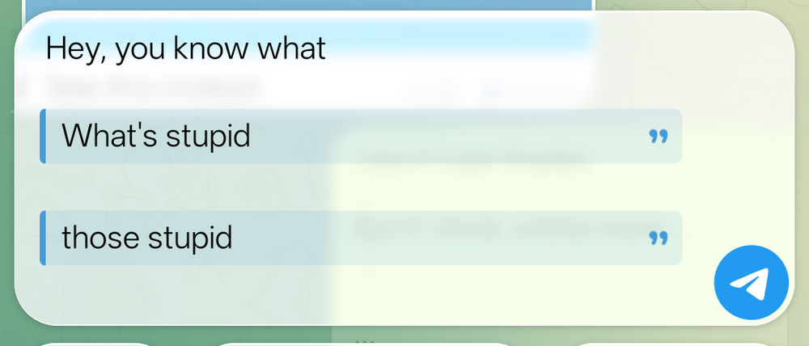

### Scheduled message triggers <!-- #reschedule --> <!-- #eventschedule -->

Pick several scheduled messages and use *Reschedule* to move them all at once with a base time and interval (give messages three minutes or more of spacing — Telegram's own scheduler can run a minute or two late).

*Send on event* can be armed in the schedule picker or directly from bulk *Reschedule*. One trigger can watch message type, text patterns, or both, then send early while each message keeps its fallback schedule. The trigger sheet labels are now explicit (`Video message`, `Any text message`) and use compact collapsible section cards (`By message type`, `Or by text`) with summaries when collapsed. Hidden invalid regex rows still auto-expand on Done and focus the exact row error. A `Presets` section lets you save the sheet's current setup under a name and reapply it later from a name-sorted list, each row showing a quick summary of what it contains. The first pattern row also gets its own clear (×) button so you can wipe its text without needing a second row to remove.

Armed triggers are managed from Chats nav ⋯ → *Message Triggers*. A disguised chat still suppresses trigger fire/stop heads-up alerts so trigger activity is not exposed through notifications.

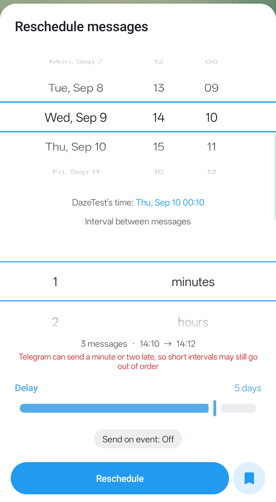
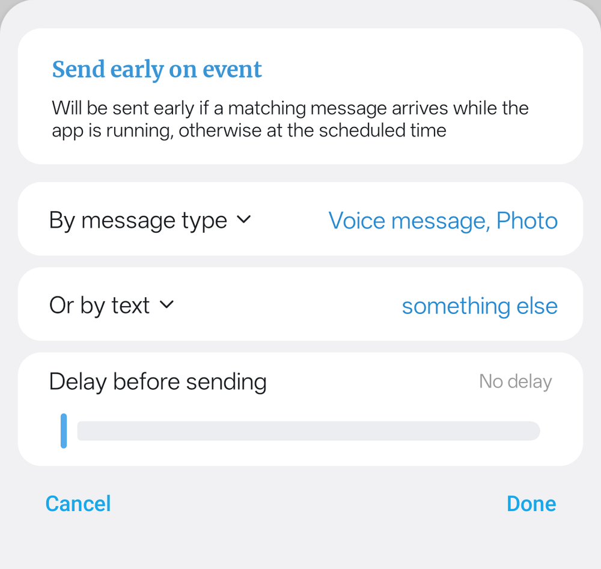
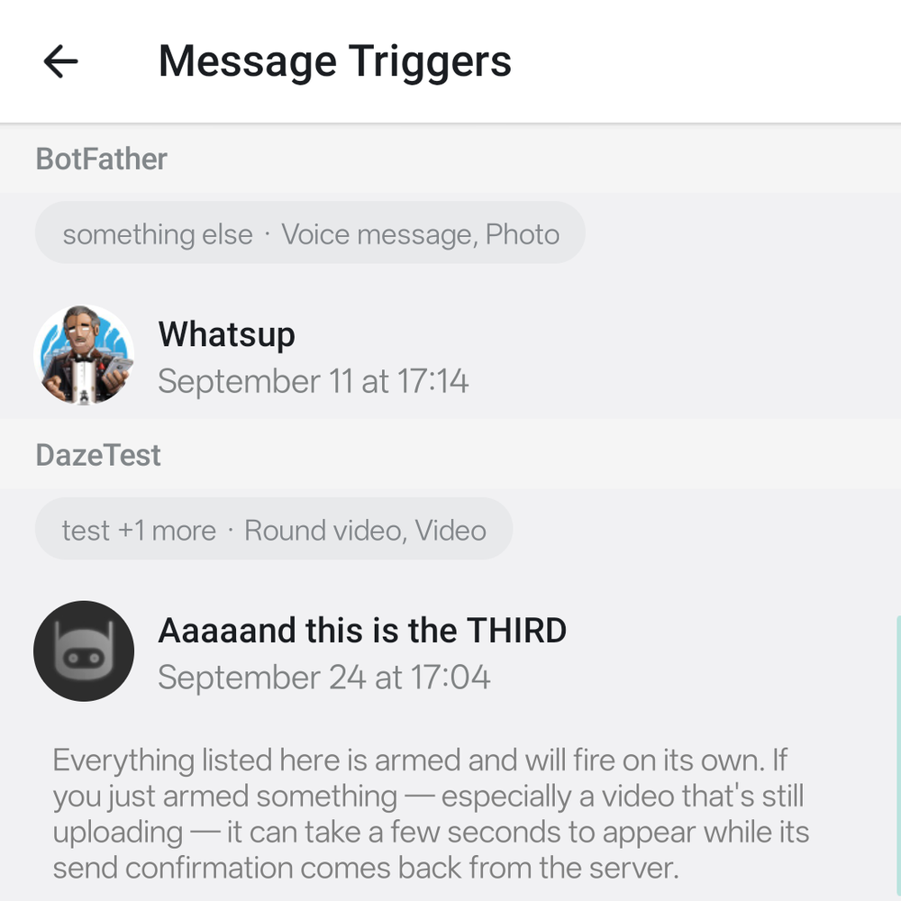

### Remember the schedule offset <!-- #schedule-remember -->

Tap the bookmark icon in the schedule picker to remember your schedule offset — new messages then default to that offset instead of 10 minutes ahead. Reschedule and Edit schedule pickers get the same delay slider, but keep opening on the message's existing time unless you drag it. Turn the bookmark off to revert to normal behavior.

### Tidier scheduled selection bar <!-- #scheduled-selection-toolbar -->

When you select messages in the scheduled view, the top bar keeps just Send Now, Reschedule, and Delete, tucking Copy and Forward into the overflow menu.

### Forward scheduled messages <!-- #scheduled-forward -->

Telegram's forward API cannot forward a message that hasn't been sent yet. The selection bar's ⋯ → Forward now re-sends the picked scheduled messages instead, so they arrive as new scheduled messages. Media must be in the app's cache to be re-sent. Polls, locations, and contacts cannot be forwarded this way.

### Repost as Copy <!-- #repost-reply --> <!-- #repost-spread -->

*Repost as Copy* comes from NagramX. Turn it on in settings (it's off by default) and it re-sends a message without a "Forwarded from" header, re-uploading the media. This fork adds three things — it keeps the original reply and quote, offers to delete the original once the repost lands, and spreads a scheduled repost across its own send times.

Reposting several messages this way — the selection bar's *NoQuote* button — sends them as copies to a chat you pick, without offering to delete the originals, spacing each one three minutes apart by default instead of stacking them on one shared timestamp, so you can reschedule or edit them individually afterwards. If something in the batch can't be reposted as a copy (polls, locations, contacts), that button falls back to an ordinary one-time forward instead. Forwarding through the chat picker's own *Send* button instead lets you set your own interval, but refuses the spread with an error rather than falling back if anything can't be reposted.

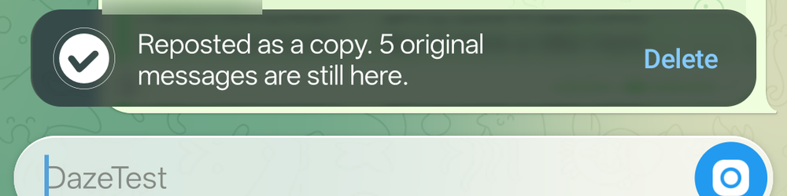

### Pin or number several messages at once <!-- #bulk-actions -->

Select messages to *Pin all* (applies your pin choice to the whole selection) or *Reply with numbers* to create an indexed table of contents via numbered replies.

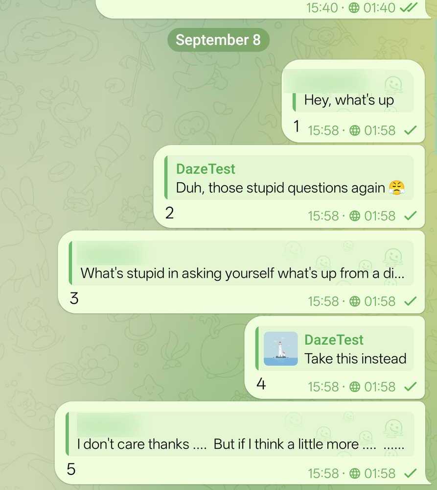

### Fullscreen message input <!-- #fullscreen-input -->

Tap the expand button to grow the input between the chat header and the keyboard. Tap it again to return to normal height.

### Don't lose typed text on an accidental back <!-- #discard-guard -->

A swipe-back gesture while composing a scheduled or edited message will hold and prompt for confirmation so you don't accidentally discard it. Unsaved text in these states also survives an app-lock or if you minimize and return to the app.

## Media and camera

### Recording mode hint <!-- #media-tooltip-repeat -->

The hint that explains how to switch between voice and round-video recording appears only a few times, then stays out of your way.

### Video message playback modes <!-- #video-playback-modes -->

A button in the player bar cycles how round video messages play — play once, play all, or repeat one.

### Mute video messages <!-- #video-mute -->

A mute button next to the playback-mode toggle silences round video messages.

### Closed captions on video messages <!-- #video-cc -->

A CC button above the transcribe button provides live, line-by-line captioning over the video. Providers that return timings (Groq, Cloudflare) get captions that line up exactly with the speech; others get evenly-paced text. Captions only ever come from a transcription you explicitly ask for, so they never trigger unasked transcriptions or use surprise API credit.

### External microphone toggle in video message popup <!-- #external-mic -->

When camera mode is set to Ask, the camera choice popup has an External Microphone toggle to record through a headset instead of the built-in mic.

### Infinite video message <!-- #infinite-video -->

*Infinite Recording* stitches 60-second round video message segments end to end instead of stopping at the usual cap. Toggle it from the camera overlay while recording — off by default, and unavailable during slow mode, paid messages, secret chats, or view-once. In a scheduled chat (camera mode set to Ask), the first segment needs at least 3 minutes' lead time (rather than the stock 1 minute) so each following segment can keep its 2-minute spacing. N-Settings → Chat → Camera → *Infinite Recording cap* sets how long it can run before it stops itself: 10 (default), 15, 20, 30, 60 minutes, or Unlimited.

### Warning before a round video message hits its limit <!-- #video-limit-warning -->

Round video recordings warn you before they end. Configured via N-Settings → Chat → Camera, you get a light warning buzz 5 seconds before the cutoff, and a medium cutoff buzz when it actually lands.

### Smoother video message zoom <!-- #video-zoom -->

The zoom control under the round video camera was rebuilt with a full-range slider and step buttons.

### Scrub the video message preview <!-- #video-scrub -->

The preview you get after recording a round video message has a playback cursor you can drag to scrub through the video.

### Bigger recorder pause and once buttons <!-- #recorder-controls -->

The pause button and the view-once "(1)" toggle are larger and lifted slightly higher off the send button to prevent accidental sends.

### Don't lose an unsent video message <!-- #video-draft-guard -->

A round video message you've recorded but haven't sent is no longer lost by accident — backing out of the chat, switching apps mid-recording, or the chat locking behind a passcode all leave the finished clip waiting in the preview (trimmed the way you left it, for up to a day) instead of discarding it. What comes back after the app or chat was torn down is the trim strip and send button, not the round preview itself, so you can send the clip but not watch it back first. One gap remains: a round video recorded in the scheduled composer isn't kept this way.

### Custom file names for saved media <!-- #custom-file-names -->

Turn on *Custom File Names* (N-Settings → General → Storage) to save videos, voice, and round messages using the message's send date and time — `20260101_173812.mp4` by default — instead of Telegram's generic `video.mp4`, `video (1).mp4`, and so on. The setting's dialog lets you customize the pattern with `{date}`, `{time}`, and `{name}` (the sender's original filename, usually blank for voice and round messages), with a live preview as you type. Two messages saved in the same second still get separate files. Saved photos are unaffected.

### Send a muted gallery video as a real video <!-- #silent-video -->

Muting a video in the gallery editor before you send it used to force it into a low-quality looping GIF with no scrubber or duration. Now the quality button stays live after you mute — tap it once and the clip becomes an ordinary silent video instead: audio stripped, but sent at a quality you pick from the usual SD/HD sheet, with a real duration and scrubber. Unmute and mute again to go back to GIF.

## Transcription

### Whisper transcription controls <!-- #whisper-transcription -->

The Whisper (Workers AI) provider settings have options to skip silent audio and disable previous context to prevent repeated or made-up phrases.

### Groq transcription provider <!-- #groq-transcription-provider -->

A fast, free voice-to-text option that runs Whisper on Groq. Audio uploads have a 25 MB ceiling on the free tier.

### Retry or switch a transcription provider <!-- #transcribe-retry -->

If multiple providers are configured, the Retry option on a transcription becomes "Retry with…". You can also long-press the transcription button on a voice or round video message to stop a running attempt and open the provider list.

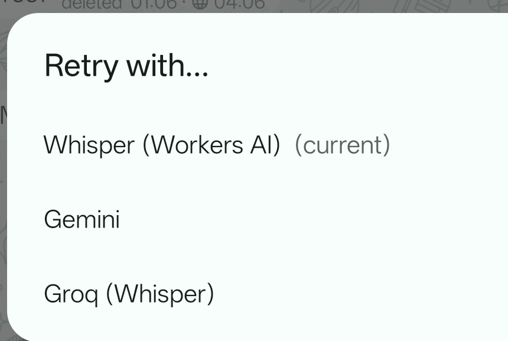

## Appearance

### Extera themes <!-- #extera-themes -->

Extera Light and Extera Dark bring [exteraGram](https://github.com/exteraSquad/exteraGram)'s look to Dazegram. The design is exteraSquad's. Only the palettes were rebuilt here — reverse-engineered rather than copied, and shipped as Monet-token theme assets — so the look, and the credit for it, stay theirs.

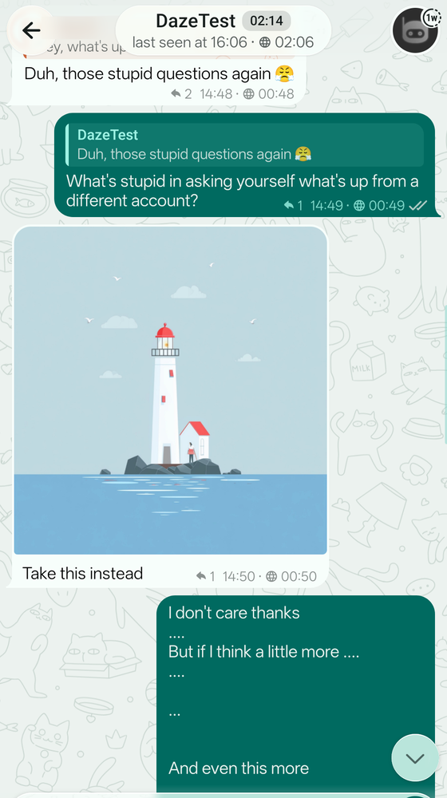
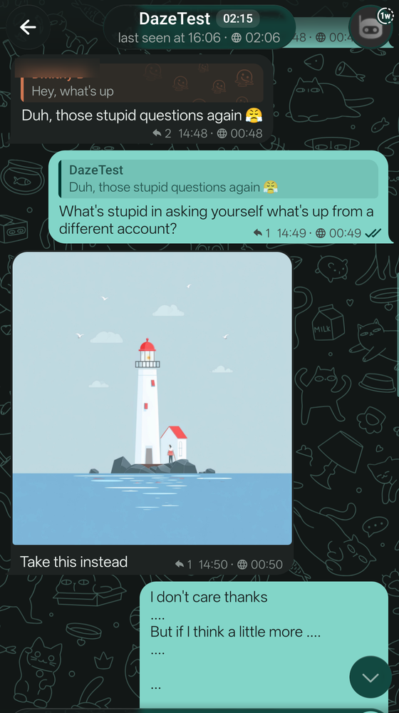

### Monet wallpaper pattern <!-- #monet-pattern-tile -->

You can apply a chat pattern over your live Material You color. Turn it off by opening the tile and clearing the pattern.

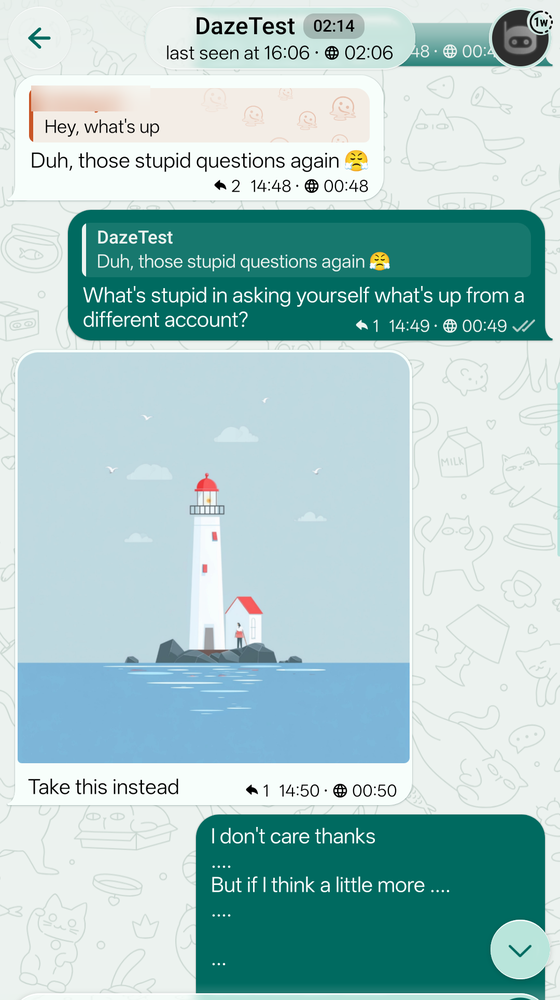

### Fixed app icon uses Default art on DazegramX <!-- #app-icon-fallback -->

On DazegramX (Unofficial), the app's fixed system-level icon — the one Android shows in the app switcher and permission dialogs, separate from your chosen home-screen launcher icon — is the same *Default* art as the Chat Settings > App Icon picker's Default option. Dazegram (Official) keeps its usual Blue icon, unchanged. Picking a different launcher icon under Chat Settings > App Icon still works exactly as before on both variants and doesn't affect this one.

<!-- Retired entries, plus sync-reconciliation and superseded feature slugs that have no catalog entry of their own.
     The behaviour still ships; it is documented in README instead of here.
     Slugs kept so old commits stay greppable and the catalog check keeps passing. -->
<!-- #nagram-sync -->
<!-- #tab-outline -->
<!-- #dazegram-icons -->
<!-- #update-checks-off -->
<!-- #metadata-channel-off -->
<!-- #solid-themes -->
<!-- The Transcription entries above were split from one commit tagged #transcribe-retry;
     #whisper-transcription and #groq-transcription-provider are new slugs for that split. -->
