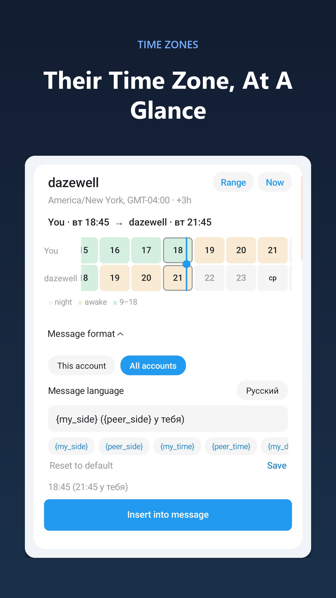
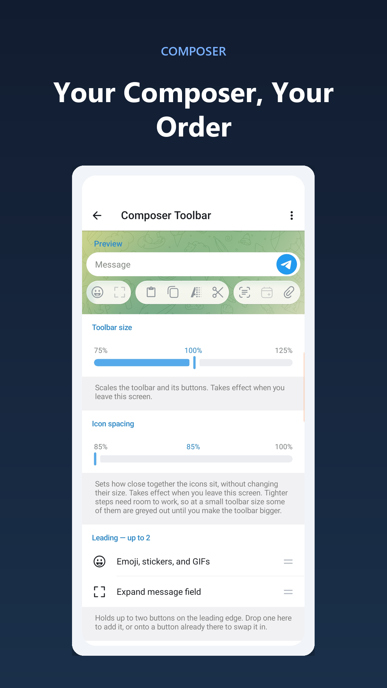
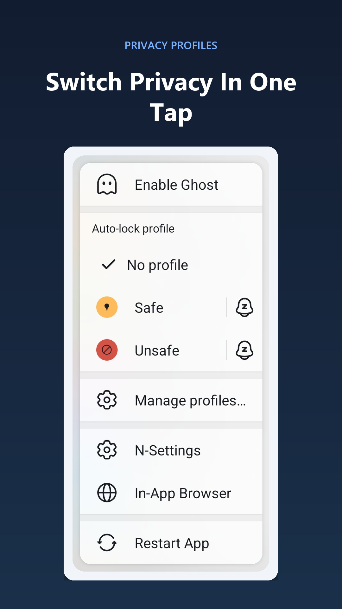
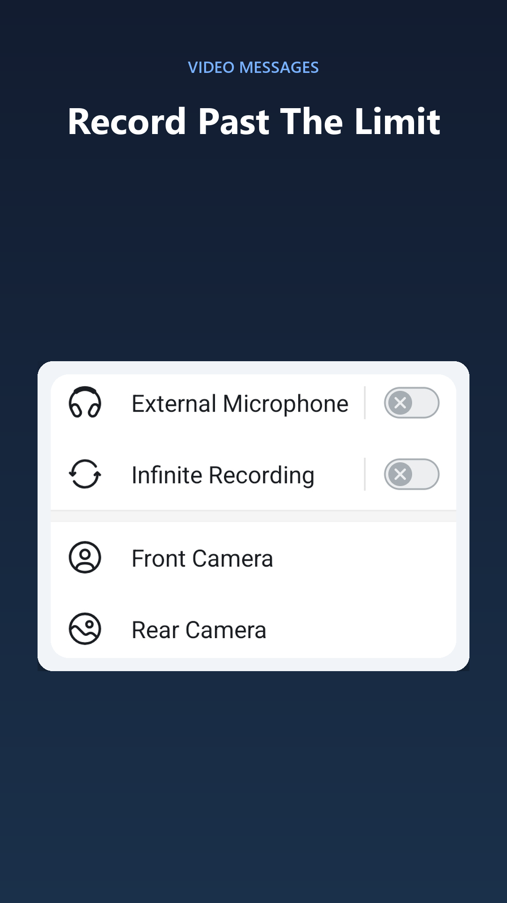

# Dazegram

Telegram, tuned for the everyday details stock Telegram skips: time zones that show up right in the chat, and privacy that isn't all-or-nothing.

Dazegram started as a fork of [NagramX](https://github.com/risin42/NagramX), which is no longer maintained. It now tracks [Nagram](https://github.com/NextAlone/Nagram) for updates, with NagramX's extras carried forward and built on top. It's maintained by [@dazewell](https://github.com/dazewell).

This README covers the highlights. The full list, with what each one does, is in [FEATURES.md](FEATURES.md).



## Highlights

- **Time zones:** Set a time zone on any chat or group and see their local time right in the header. Tap it to line up a moment across both zones and drop it straight into your message.
- **Composer:** Reorder most of the composer's row: emoji, attachments, formatting, schedule, into the layout you actually reach for.

  

- **Everyday reliability:** The scheduled-message composer and message editing keep what you typed if you back out by accident, lock the app, or minimize it. Normal composing already autosaves, so nothing changes there.
- **Privacy profiles:** Save named auto-lock timeouts and switch between them with a long-press, instead of digging back into settings every time you need a longer or shorter leash.

  

- **Video messages:** Record round video messages past Telegram's limit, with a warning buzz before it cuts and captions, once you've set up transcription.

  

- **Private chats:** Hide a chat's last message from the list, or lock the whole chat behind your passcode (which hides it too): your call, per chat.

There's more: FEATURES.md has all of it, with what each one does and where to find it in the app.

Two builds, two package names: see [Package names](#package-names) below for which one to pick.

## Download

Latest versions are available through:
* [GitHub Actions](https://github.com/dazewell/Dazegram/actions/workflows/staging.yml) (CI Artifacts)
* [GitHub Releases](https://github.com/dazewell/Dazegram/releases) (Latest Stable)

## Package names

I ship two builds, and each one deliberately borrows another app's package name:

* **Dazegram** — `org.telegram.messenger.beta` (Telegram Beta's package)
* **DazegramX** — `nekox.messenger` (NekoX's package)

This is on purpose. Icon packs already ship custom icons for Telegram Beta and NekoX, so by parasiting on their package names my builds get themed icons out of the box instead of waiting for any pack to add me. The catch is that you can't keep the app I'm borrowing from installed at the same time, since Android won't allow two apps to share one package name.

## Verify APK

Both builds are signed with my certificate:

* SHA-256: `40:56:B5:DF:0C:20:58:46:51:EE:AF:70:95:A8:EF:5A:A4:73:02:4D:8A:22:57:7E:89:F0:85:A8:EF:3A:24:4C`

## Compilation Guide

1. Clone the repository with its submodules:

    ```bash
    git clone --recursive --shallow-submodules https://github.com/dazewell/Dazegram.git Dazegram
    ```

    If you already cloned the repository without submodules, run:

    ```bash
    git submodule update --init --recursive --depth=1
    ```

2. Obtain API credentials (`TELEGRAM_APP_ID` and `TELEGRAM_APP_HASH`) from [Telegram Developer Portal](https://my.telegram.org/auth). Create `local.properties` in the project root with:

   ```properties
   TELEGRAM_APP_ID=<your_telegram_app_id>
   TELEGRAM_APP_HASH=<your_telegram_app_hash>
   ```

3. For APK signing: Replace `release.keystore` with your keystore and add signing configuration to `local.properties`:

   ```properties
   KEYSTORE_PASS=<your_keystore_password>
   ALIAS_NAME=<your_alias_name>
   ALIAS_PASS=<your_alias_password>
   ```

4. For FCM support: Replace `TMessagesProj/google-services.json` with your own configuration file.

5. Replace project-specific metadata:

    - Set your Google Maps API key in the `com.google.android.maps.v2.API_KEY` meta-data entry in `TMessagesProj/src/main/AndroidManifest.xml`.
    - Set `BaseRemoteHelper.CHANNEL_METADATA_ID` in `TMessagesProj/src/main/java/tw/nekomimi/nekogram/helpers/remote/BaseRemoteHelper.java` to your metadata channel's numeric ID, without the `-100` prefix.

6. Open the project in Android Studio to start building.

## GitHub Actions Build

1. Replace `TMessagesProj/release.keystore` with your keystore file.

2. Configure `local.properties` with the following:

   ```properties
   KEYSTORE_PASS=<your_keystore_password>
   ALIAS_NAME=<your_alias_name>
   ALIAS_PASS=<your_alias_password>
   TELEGRAM_APP_ID=<your_telegram_app_id>
   TELEGRAM_APP_HASH=<your_telegram_app_hash>
   ```

   Base64 encode the contents of this file.

3. Configure GitHub Action secrets:
   - `LOCAL_PROPERTIES`: Base64-encoded content from step 2
   - `HELPER_BOT_TOKEN`: Telegram bot token from [@Botfather](https://t.me/Botfather) (e.g., `1111:abcd`)
   - `HELPER_BOT_TARGET`: Primary Telegram chat ID (e.g., `777000`)

4. Trigger the Staging build workflow (or push to `dev`).

## License

GPLv3 — see [LICENSE](LICENSE). Telegram for Android is GPL-2.0-or-later; this fork ships under GPLv3.

## Acknowledgments

- [AyuGram](https://github.com/AyuGram/AyuGram4A)
- [Cherrygram](https://github.com/arsLan4k1390/Cherrygram)
- [Dr4iv3rNope](https://github.com/Dr4iv3rNope/NotSoAndroidAyuGram)
- [exteraGram](https://github.com/exteraSquad/exteraGram)
- [Nagram](https://github.com/NextAlone/Nagram)
- [Nekogram](https://github.com/Nekogram/Nekogram)
- [OctoGram](https://github.com/OctoGramApp/OctoGram)
