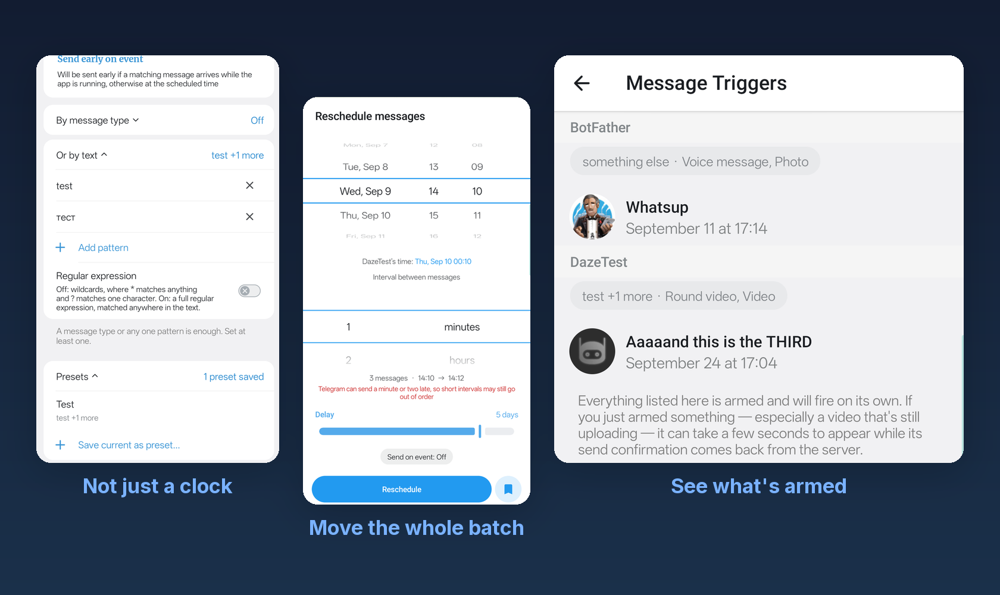
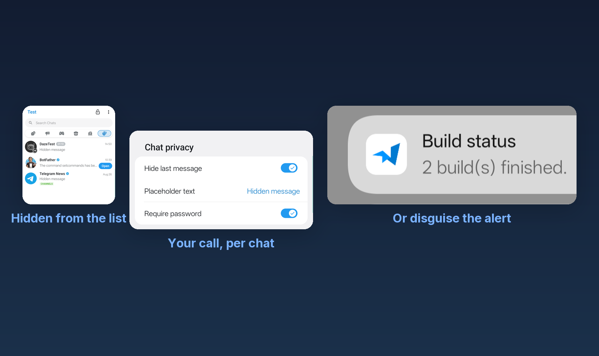
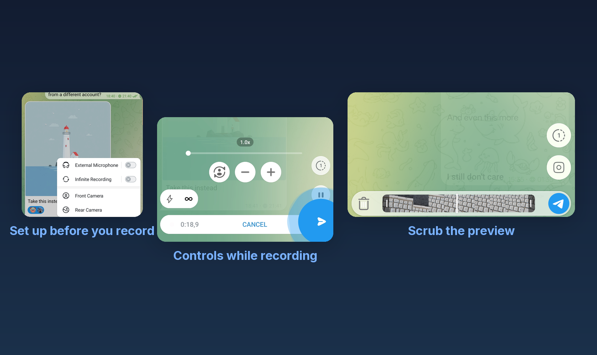
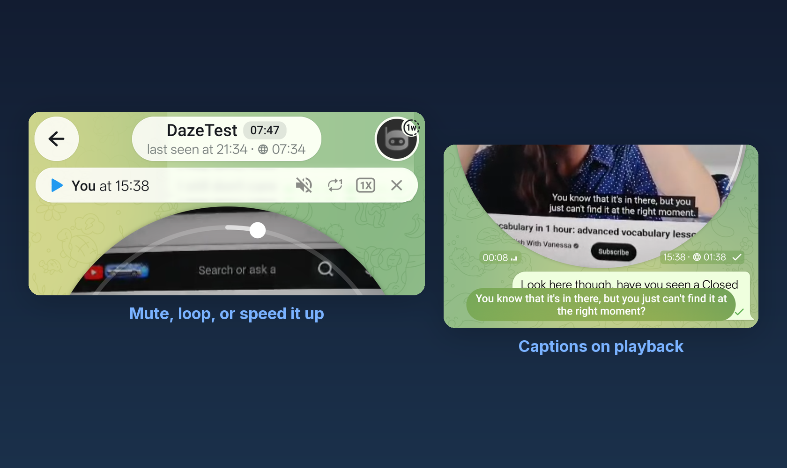
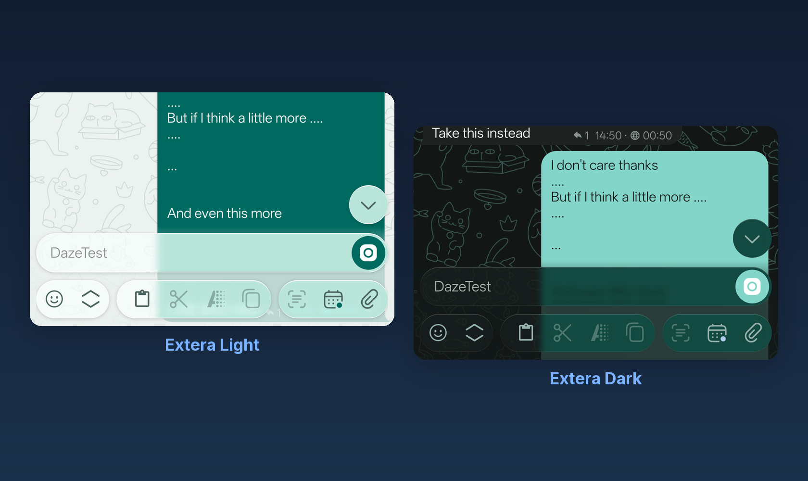

# Dazegram

Telegram, tuned for the everyday details stock Telegram skips: time zones that show up right in the chat, and privacy that isn't all-or-nothing.

Dazegram started as a fork of [NagramX](https://github.com/risin42/NagramX), which is no longer maintained. It now tracks [Nagram](https://github.com/NextAlone/Nagram) for updates, with NagramX's extras carried forward and built on top. It's maintained by [@dazewell](https://github.com/dazewell). I'm a software developer engineer with 10+ years of experience and this is my personal project which I use daily on my phone - and this is going to be my only commit in this repository made by me and written by me e2e - the rest is written by the Agents team I'm experimenting with here. I'm using them to build the features I need and at the same time to learn how to efficiently use AI in my development life. Feel free to post issues/bugs and my team will triage them and see if we can/would do it. Enjoy!

This README covers the highlights. The full list, with what each one does, is in [FEATURES.md](FEATURES.md).

## Highlights

**Time zones:** Stop doing the math in your head. Set a chat or group's time zone once from its profile screen, and their local time sits in the header and beside every message — so you can see what time it was for them when they said it. Tap it to line up a moment across both zones and drop it straight into your message.

<p align="center">

</p>

**Composer:** Every editor you use has a toolbar. Messages never did — so Dazegram built one. Cut, copy, paste, formatting, quote, schedule, attach, in blurred glass under the message field. You decide which buttons are there, in what order, and how big.

<p align="center">

</p>

**Scheduled messages:** A schedule is usually just a clock: pick a time, wait for it. Arm a trigger instead and a message sends early the moment a reply matches a message type or a bit of text, keeping its original time as a fallback if it never does. Save a set of conditions you reach for often as a named preset and put it back in two taps. Bulk-reschedule a whole batch at once, spread by an interval, instead of dragging each one by hand.

<p align="center">

</p>

**Privacy profiles:** Your auto-lock shouldn't be the same at home as it is on a train. Save named timeouts and switch to one temporarily — for now, for a set stretch of time, or until a given moment. Long-press the Settings tab in the chat list to swap between them.

<p align="center">

</p>

**Chat privacy:** Locking the whole app is a blunt instrument when only one chat is sensitive. Hide a chat's last message from the list, or put the chat itself behind your passcode — your call, per chat, from its ⋯ menu. Turn on disguise notifications and alerts show a cover instead of the real sender and message.

<p align="center">

</p>

**Recording video messages:** A round message is a video like any other — so it finally behaves like one. Set the mic and camera before you start, keep recording past Telegram's limit with a buzz to warn you before it cuts, and scrub the preview before you send.

<p align="center">

</p>

**Watching video messages:** Sometimes you just can't play the sound. The player panel under the chat title lets you mute a round message outright, or set how they play — once, all of them in a row, or the same one on repeat. With transcription set up, you can read it as captions instead.

<p align="center">

</p>

**Appearance:** Stock Telegram gives you light, dark, and not much else. Extera Light and Extera Dark restyle the whole app rather than just an accent colour, and in both, the chat wallpaper's pattern shows straight through the composer's glass instead of stopping at the colour behind it. A separate pattern option tints that same wallpaper with your phone's live Material You accent colour instead of a fixed image. The Extera look is [exteraGram](https://github.com/exteraSquad/exteraGram)'s, by exteraSquad — only its palettes were rebuilt here, reverse-engineered rather than copied.

<p align="center">

</p>

**Everyday reliability:** Normal composing already saved your draft. Editing a message, scheduling one, and recording a round video didn't — now they do. Back out by accident, lock the app, or switch away mid-recording, and what you had is still waiting when you come back.

There's more: [FEATURES.md](FEATURES.md) has all of it, with what each one does and where to find it in the app.

Two builds, two package names: see [Package names](#package-names) below for which one to pick.

## Download

Latest versions are available through:
* [GitHub Actions](https://github.com/dazewell/Dazegram/actions/workflows/staging.yml) (CI Artifacts)
* [GitHub Releases](https://github.com/dazewell/Dazegram/releases) (Latest Stable)

## Updates

App updates come through GitHub Releases, with test builds available from GitHub Actions. In-app checks are intentionally unavailable because the old inherited metadata source is no longer maintained. Update Channel and manual checks therefore show Unavailable; on a fresh install, the remote Emoji Sets catalog stays empty and Fix Link Preview has no remote rules to apply.

## Package names

I ship two builds, and each one deliberately borrows another app's package name:

* **Dazegram** — `org.telegram.messenger.beta` (Telegram Beta's package)
* **DazegramX** — `nekox.messenger` (NekoX's package)

This is on purpose. Icon packs already ship custom icons for Telegram Beta and NekoX, so by parasiting on their package names my builds get themed icons out of the box instead of waiting for any pack to add me. The catch is that you can't keep the app I'm borrowing from installed at the same time, since Android won't allow two apps to share one package name.

## Verify APK

Both builds are signed with my certificate:

* SHA-256: `40:56:B5:DF:0C:20:58:46:51:EE:AF:70:95:A8:EF:5A:A4:73:02:4D:8A:22:57:7E:89:F0:85:A8:EF:3A:24:4C`

## Compilation Guide

1. Clone the repository with its submodules:

    ```bash
    git clone --recursive --shallow-submodules https://github.com/dazewell/Dazegram.git Dazegram
    ```

    If you already cloned the repository without submodules, run:

    ```bash
    git submodule update --init --recursive --depth=1
    ```

2. Obtain API credentials (`TELEGRAM_APP_ID` and `TELEGRAM_APP_HASH`) from [Telegram Developer Portal](https://my.telegram.org/auth). Create `local.properties` in the project root with:

   ```properties
   TELEGRAM_APP_ID=<your_telegram_app_id>
   TELEGRAM_APP_HASH=<your_telegram_app_hash>
   ```

3. For APK signing: Replace `release.keystore` with your keystore and add signing configuration to `local.properties`:

   ```properties
   KEYSTORE_PASS=<your_keystore_password>
   ALIAS_NAME=<your_alias_name>
   ALIAS_PASS=<your_alias_password>
   ```

4. For FCM support: Replace `TMessagesProj/google-services.json` with your own configuration file.

5. Replace project-specific metadata:

    - Set your Google Maps API key in the `com.google.android.maps.v2.API_KEY` meta-data entry in `TMessagesProj/src/main/AndroidManifest.xml`.
    - Set `BaseRemoteHelper.CHANNEL_METADATA_ID` in `TMessagesProj/src/main/java/tw/nekomimi/nekogram/helpers/remote/BaseRemoteHelper.java` to your metadata channel's numeric ID, without the `-100` prefix.

6. Open the project in Android Studio to start building.

## GitHub Actions Build

1. Replace `TMessagesProj/release.keystore` with your keystore file.

2. Configure `local.properties` with the following:

   ```properties
   KEYSTORE_PASS=<your_keystore_password>
   ALIAS_NAME=<your_alias_name>
   ALIAS_PASS=<your_alias_password>
   TELEGRAM_APP_ID=<your_telegram_app_id>
   TELEGRAM_APP_HASH=<your_telegram_app_hash>
   ```

   Base64 encode the contents of this file.

3. Configure GitHub Action secrets:
   - `LOCAL_PROPERTIES`: Base64-encoded content from step 2
   - `HELPER_BOT_TOKEN`: Telegram bot token from [@Botfather](https://t.me/Botfather) (e.g., `1111:abcd`)
   - `HELPER_BOT_TARGET`: Primary Telegram chat ID (e.g., `777000`)

4. Trigger the Staging build workflow (or push to `dev`).

## License

GPLv3 — see [LICENSE](LICENSE). Telegram for Android is GPL-2.0-or-later; this fork ships under GPLv3.

## Acknowledgments

- [AyuGram](https://github.com/AyuGram/AyuGram4A)
- [Cherrygram](https://github.com/arsLan4k1390/Cherrygram)
- [Dr4iv3rNope](https://github.com/Dr4iv3rNope/NotSoAndroidAyuGram)
- [exteraGram](https://github.com/exteraSquad/exteraGram) — the Extera Light and Dark look, by exteraSquad; its palettes were reverse-engineered here rather than copied
- [Nagram](https://github.com/NextAlone/Nagram)
- [NagramX](https://github.com/risin42/NagramX)
- [Nekogram](https://github.com/Nekogram/Nekogram)
- [OctoGram](https://github.com/OctoGramApp/OctoGram)
